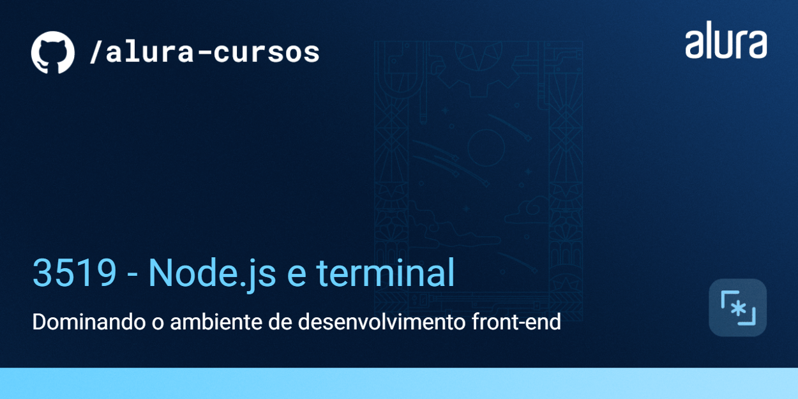

# VidFlow

O VidFlow é uma plataforma de compartilhamento de vídeos.


## 🔨 Funcionalidades do projeto

Atualmente, o visual do projeto e sua funcionalidade de buscar em uma API pelas informações dos vídeos já estão prontos.

Agora, o time de desenvolvimento do VidFlow decidiu aplicar o uso de novas ferramentas que irão melhorar a qualidade do código do projeto, como o ESLint, Prettier, Axios e o Vite.

Para isso, aprenderemos a utilizar o **Node.js**, necessário para aplicar todas essas ferramentas.

## ✔️ Técnicas e tecnologias utilizadas

- Node.js
- NPM
- Os pacotes ESLint, Prettier, JSON Server, Axios e Vite
- Vercel

## Link do Figma

[Acesse o Figma do Vidflow](https://www.figma.com/file/a0crwitCtGmNIQW0RVIs5H/VidFlow-%7C-Curso-Js---Consumindo-dados-de-uma-API?node-id=0%3A1&mode=dev).

## 🛠️ Abrir e rodar o projeto

Após baixar ou clonar o projeto deste repositório, você precisa ter o [Node.js](https://nodejs.org/) e o [`json-server`](https://www.npmjs.com/package/json-server) instalados.

Caso não tenha o `json-server` instalado globalmente, execute o seguinte comando:

```bash
npm install -g json-server@0.17.4
```

Com o Node.js e o `json-server` instalados, execute o seguinte comando para disponibilizar a API local de vídeos:

```bash
json-server --watch backend/videos.json
```

Em seguida, abra o `index.html` no navegador e o VidFlow já pode ser visualizado!

## 📚 Mais informações do curso

Este repositório avança até o uso do ESLint e Prettier, mas ainda não está utilizando o Vite junto com o Axios. Para usar o Vite, foi necessário a migração do código para um novo projeto, que você encontra [nesse repositório](https://github.com/alura-cursos/3519-nodejs-vidflow-vite).
